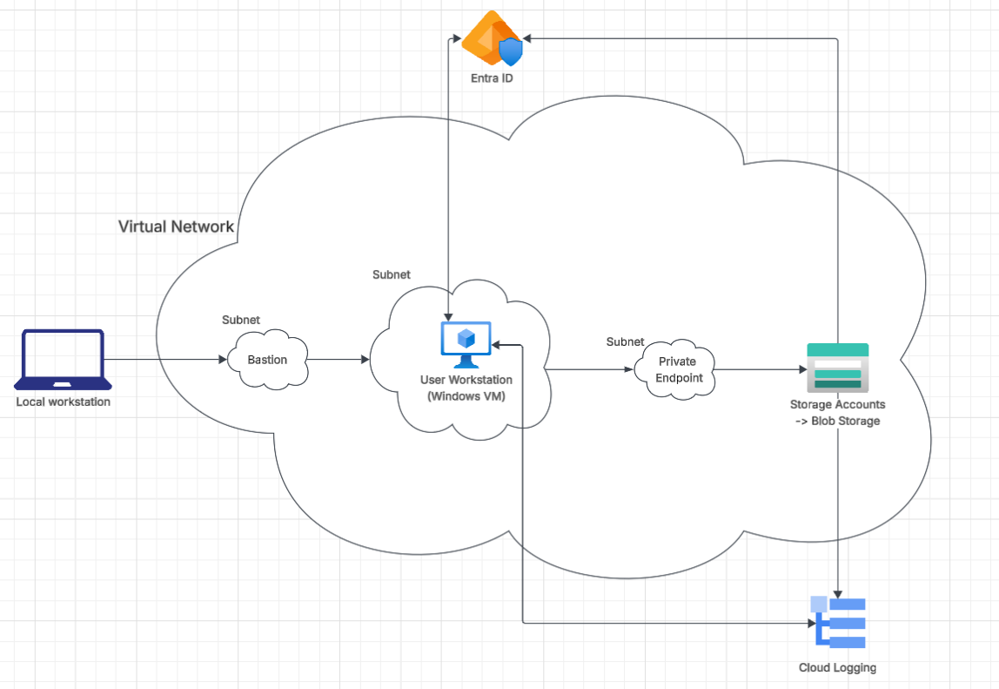

# Azure Secure Internal Platform
> A secure, isolated cloud platform for corporate environments — zero public exposure, full DevOps cycle: manual provisioning → IaC (Terraform) → OS configuration (Ansible) → CI/CD (GitHub Actions).

---

## Table of content

- [Architecture](Architecture/Secure-Internal-Platform-Architecture-V2.png)
- [Configuration](docs/configuration.md)

## Business Problem

**Context:**
Small and medium-sized companies often deploy infrastructure manually through the Azure portal. Every new environment takes hours of clicking, is inconsistent, and prone to configuration errors. Lack of identity-based access control means VMs are exposed to the public internet on port 3389 — constantly scanned by botnets. Storage Accounts are often publicly accessible due to misconfigured network settings. No change is auditable — nobody knows who changed what and when.

**Solution:**
This project builds an isolated Azure platform where no resource has a public IP. Administrative access to VMs is exclusively through Azure Bastion with Entra ID authentication. The Storage Account is accessible only through a Private Endpoint with a private IP inside the VNet. The entire infrastructure is defined as code (Terraform) and deployed through a CI/CD pipeline with a manual approval gate before every production change.

**Measurable outcomes:**
- Public exposure: VM and Storage without public IPs — zero attack vectors from the internet

---

## Architecture

**Components and their role:**

| Component | Role in project | Why this approach |
|---|---|---|
| Azure Bastion (Standard) | Secure RDP access without public IP | Standard SKU required for native Entra ID login |
| Private Endpoint + DNS | Storage accessible only inside VNet | `nslookup` returns private IP — traffic never leaves Azure backbone |
| Entra ID Join | Login with organizational account, not local | Central IAM, MFA, Conditional Access — no reliance on local passwords |
| NSG on snet-workload | RDP allowed only from AzureBastionSubnet | Zero direct VM access from outside |

---

## Key Technical Decisions

### Why Private Endpoint for Storage instead of Service Endpoint?
Service Endpoint optimizes the network route, but Storage still has a public IP — someone from outside can try to connect (and succeed if the firewall is misconfigured). Private Endpoint gives Storage a private IP inside the VNet: traffic never goes to the internet, and a misconfigured firewall won't open external access. Private DNS Zone automatically resolves `*.blob.core.windows.net` to the private IP — without any manual DNS configuration on the VM.

### Why NSG at subnet level instead of NIC level?
An NSG at the subnet level applies to all VMs in that subnet — adding a new VM doesn't require manual NSG configuration. NIC-level NSG would be more granular, but in this project all VMs in snet-workload have the same security requirements.

---

## Tech Stack

| Category | Technology |
|---|---|
| Cloud | Microsoft Azure |

---

## How to Run the Project (Quickstart)

---

## Author

**Krystian Sąsiadek**
[LinkedIn](https://linkedin.com/in/krystiansasiadek) · [GitHub](https://github.com/KrystianSA)

> *Project built as hands-on preparation for the AZ-104 exam and as portfolio material demonstrating a full DevOps cycle: provisioning → IaC → OS configuration → CI/CD. Every technical decision is justified by a business reason — not "because the tutorial said so", but "because it solves a specific problem".*
